# Frontend Mentor - REST Countries API with color theme switcher solution

This is a solution to the [REST Countries API with color theme switcher challenge on Frontend Mentor](https://www.frontendmentor.io/challenges/rest-countries-api-with-color-theme-switcher-5cacc469fec04111f7b848ca). Frontend Mentor challenges help you improve your coding skills by building realistic projects.

## Table of contents

- [The challenge](#the-challenge)
- [Screenshot](#screenshot)
- [Links](#links)
- [Built with](#built-with)
- [Author](#author)

### The challenge

Users should be able to:

- See all countries from the API on the homepage
- Search for a country using an `input` field
- Filter countries by region
- Click on a country to see more detailed information on a separate page
- Click through to the border countries on the detail page
- Toggle the color scheme between light and dark mode _(optional)_

### Screenshot

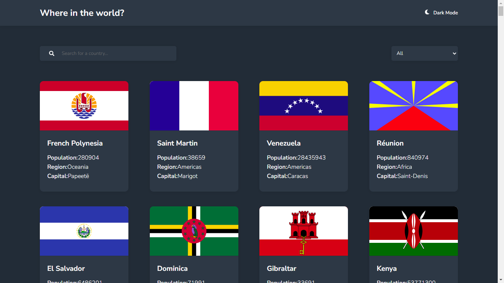
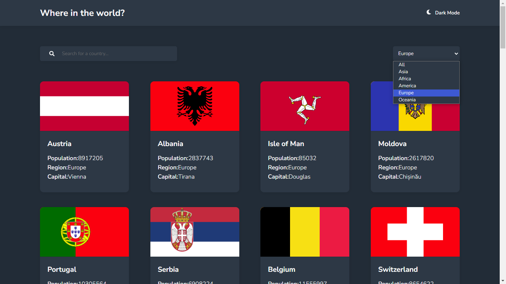
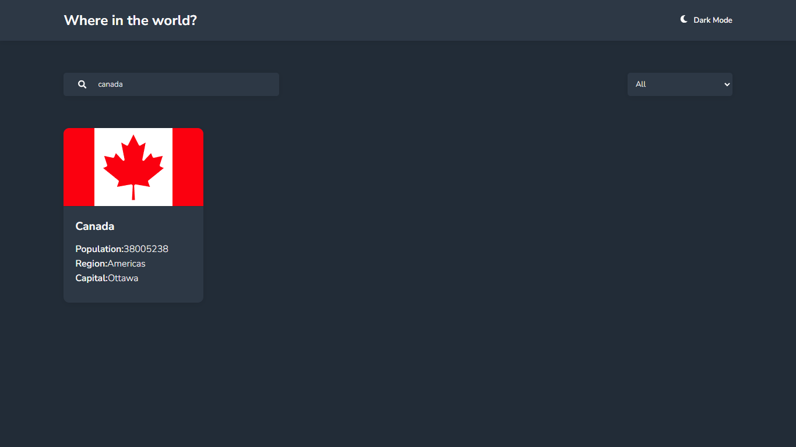
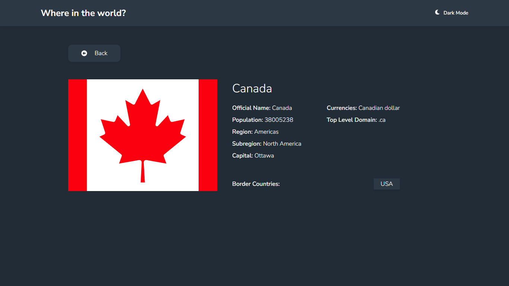
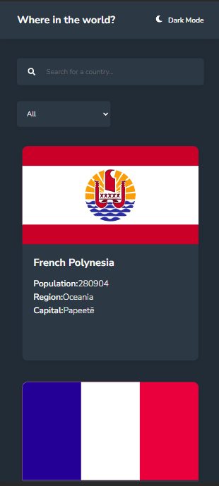
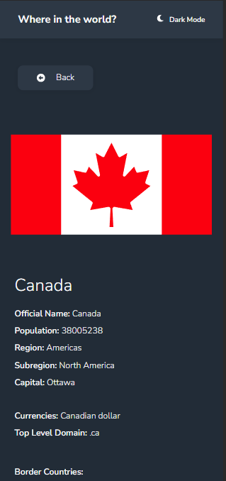
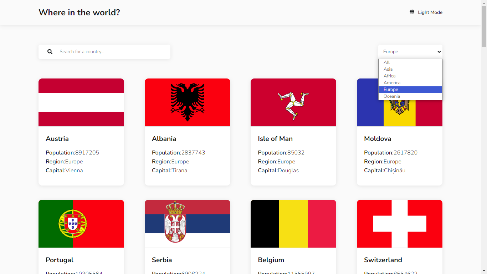
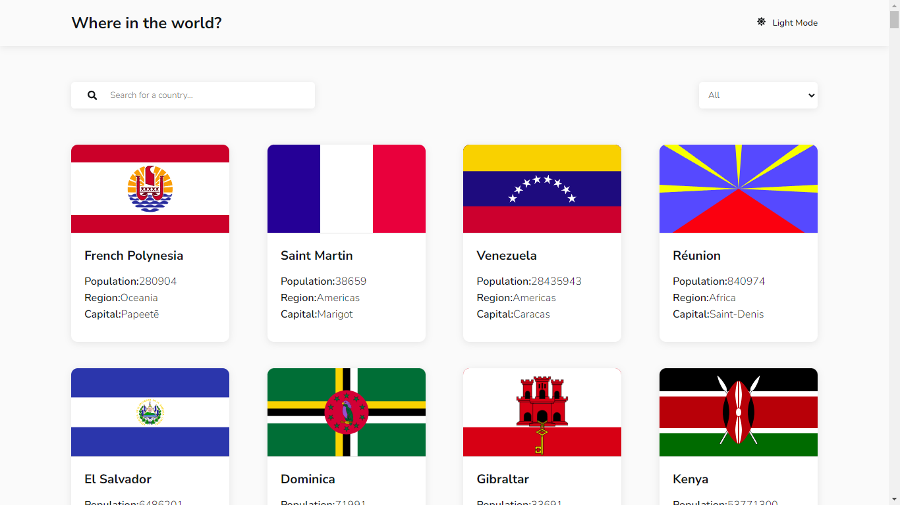
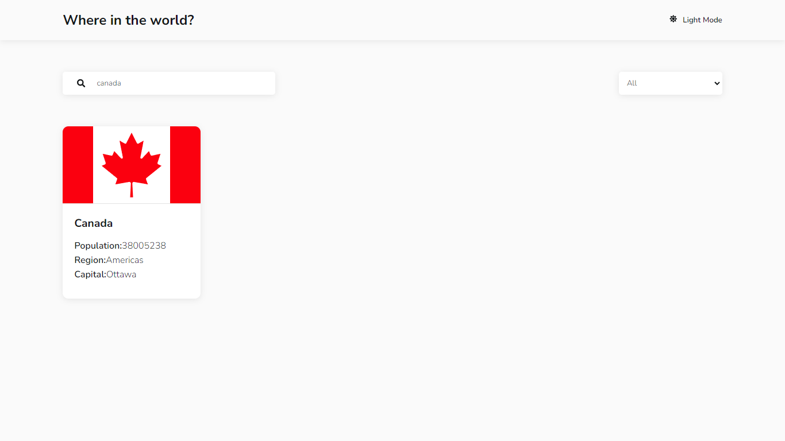
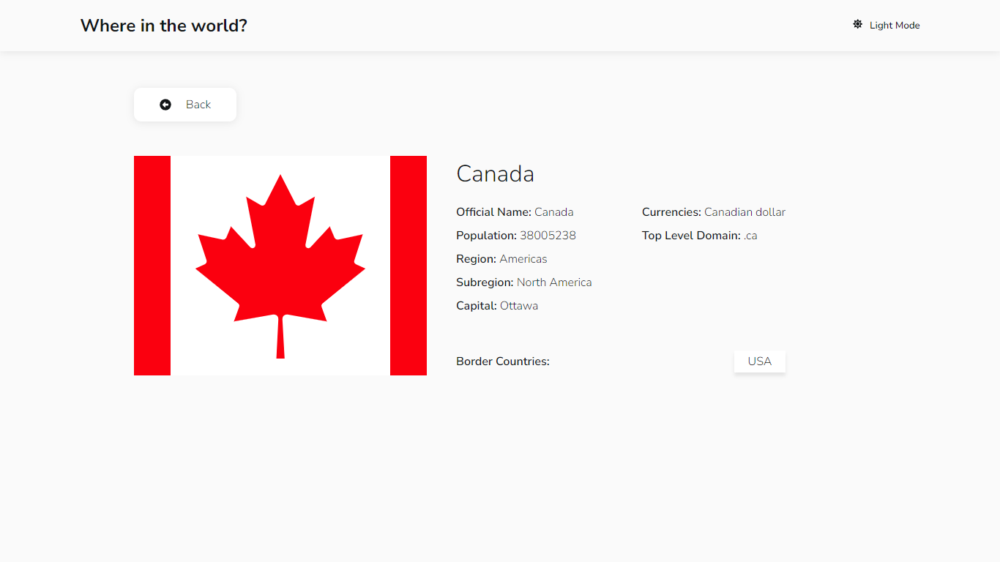
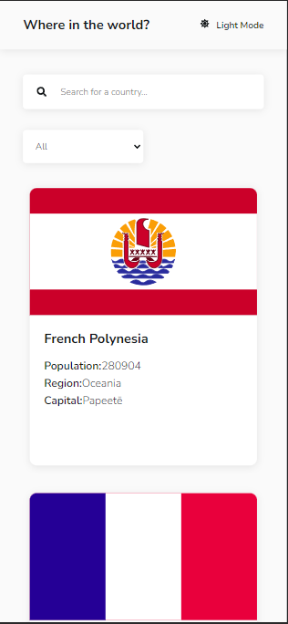
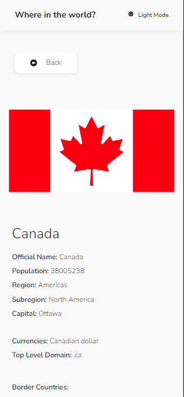

### Links

- Solution URL: [https://www.frontendmentor.io/solutions/responsive-app-built-with-react-sass-with-theme-switcher-yze3mS0pA3](https://www.frontendmentor.io/solutions/responsive-app-built-with-react-sass-with-theme-switcher-yze3mS0pA3) 
- Live Site URL: [https://snazzy-malasada-b4cc16.netlify.app/](https://snazzy-malasada-b4cc16.netlify.app/)

### Built with

- CSS custom properties
- Flexbox
- Mobile-first workflow
- [React](https://reactjs.org/) - JS library
- [Sass](https://sass-lang.com/) - For styles

## Author

- Frontend Mentor - [@AltamiroF-22](https://www.frontendmentor.io/profile/AltamiroF-22)
- Instagram - [@junior.rx22](https://www.instagram.com/junior.rx22/)
